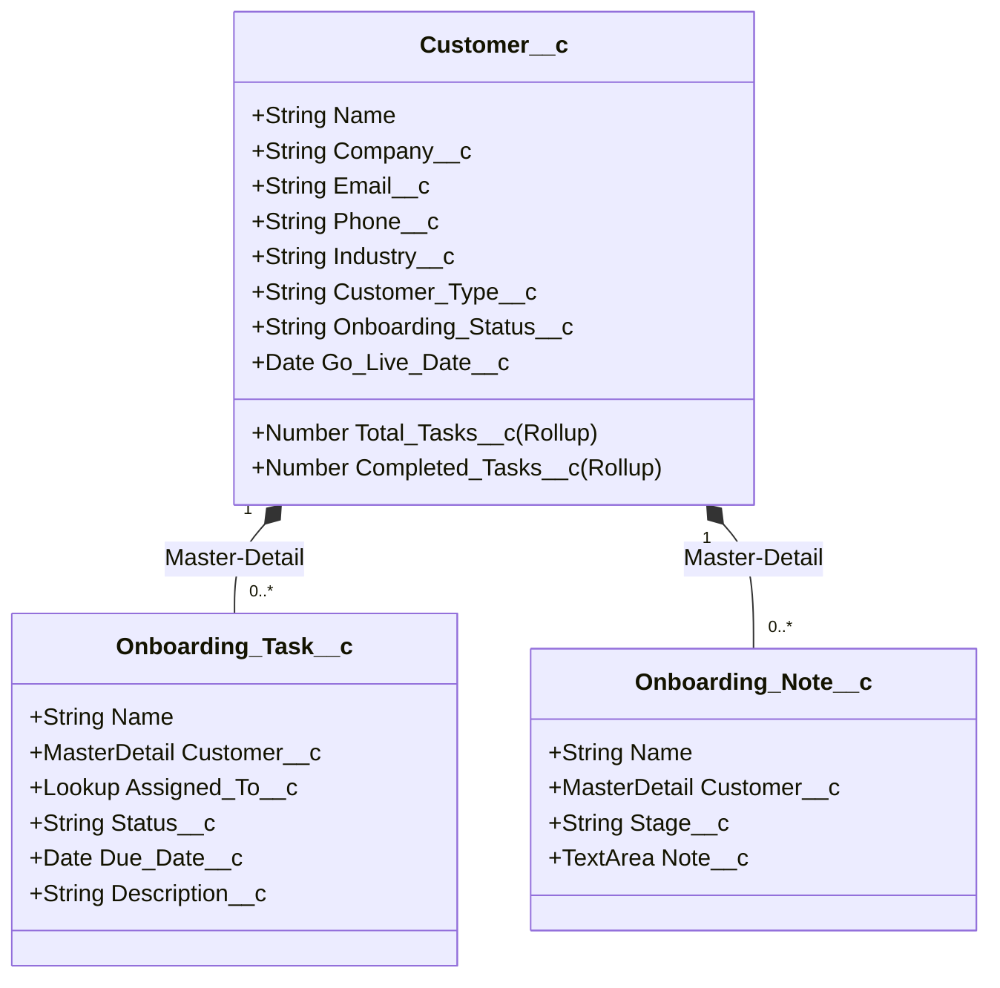

# Salesforce DX Project

Salesforce DX is a development approach that brings source-driven development, team collaboration, and continuous integration to the Salesforce Platform. Instead of working directly in an org through a web browser, you work with metadata as source files in a local DX project, track changes in version control, and deploy through automated processes.

This project template gets you started with the tools and structure you need to build Salesforce applications using source control, scratch orgs, and the Salesforce CLI.

## Prerequisites

Before you start, make sure you have:

- **Salesforce CLI** - Download from [developer.salesforce.com/tools/salesforcecli](https://developer.salesforce.com/tools/salesforcecli). See [Install Salesforce CLI](https://developer.salesforce.com/docs/atlas.en-us.sfdx_setup.meta/sfdx_setup/sfdx_setup_install_cli.htm) for details.
- **VS Code with Salesforce Extension Pack** - See [Installation Instructions](https://developer.salesforce.com/docs/platform/sfvscode-extensions/guide/install.html) for details. Includes the Agentforce Vibes extension.
- **A development org** - Sign up for a free Developer Edition org [here](https://developer.salesforce.com/signup).
- **Dev Hub enabled** (optional, required to create scratch orgs) - You can enable Dev Hub in your development org under Setup > Dev Hub.  See [Provide Developers Access to Salesforce DX Tools](https://developer.salesforce.com/docs/atlas.en-us.sfdx_dev.meta/sfdx_dev/sfdx_setup_dx_tools.htm).

## Project Structure

Your DX project follows this structure:

- **`force-app/main/default/`** - Your metadata source files live in this default package directory. You can configure additional package directories in the `sfdx-project.json` file.
- **`config/`** - Scratch org definitions and project settings
- **`scripts/`** - Automation scripts for common tasks
- **`sfdx-project.json`** - Project manifest that defines package directories, namespace, API version, and other project-level settings

See [Salesforce DX Project Configuration](https://developer.salesforce.com/docs/atlas.en-us.sfdx_dev.meta/sfdx_dev/sfdx_dev_ws_config.htm).

## Get Started

Ready to start developing? The [Get Started with Salesforce DX](https://developer.salesforce.com/docs/atlas.en-us.sfdx_dev.meta/sfdx_dev/sfdx_dev_get_started_dx.htm) guide walks you through your first project, from creating a scratch org to creating a simple Apex class or LWC to deploying your code to a sandbox.

## Common Salesforce CLI Commands

Here are common CLI commands that you'll use the most:

- `sf org login web`: Authorize an org
- `sf org open`: Open your org in a browser
- `sf org create scratch`: Create a scratch org
- `sf project deploy start`: Deploy metadata to your org
- `sf project retrieve start`: Retrieve metadata from your org
- `sf template generate <artifact>`: Scaffold new components, such as Apex classes and triggers, LWC components, Lightning apps, and more
- `sf apex <command>`: Run Apex tests, run anonymous Apex blocks, and view logs
- `sf data <command>`: Work with test data
- `sf alias <command>`: Manage org aliases
- `sf config <command>`: Configure CLI settings

## Use Agentforce Vibes to Build Lightning Apps

Transform your ideas into custom Lightning apps that extend CRM workflows directly in Lightning Experience. Through natural conversations with Agentforce Vibes, implement custom objects and fields, complex business logic, and dynamic UI components. See [Build a Lightning App Using Agentforce Vibes](https://developer.salesforce.com/docs/platform/einstein-for-devs/guide/lexapp-overview.html).

## Additional Resources

- [Agentforce Vibes Developer Guide](https://developer.salesforce.com/docs/platform/einstein-for-devs/guide/einstein-overview.html)
- [Salesforce CLI Installation Guide](https://developer.salesforce.com/docs/atlas.en-us.sfdx_setup.meta/sfdx_setup/sfdx_setup_intro.htm)
- [Salesforce DX Developer Guide](https://developer.salesforce.com/docs/atlas.en-us.sfdx_dev.meta/sfdx_dev/)
- [Salesforce CLI Command Reference](https://developer.salesforce.com/docs/atlas.en-us.sfdx_cli_reference.meta/sfdx_cli_reference/)
- [Salesforce CLI Plugin Development Guide](https://developer.salesforce.com/docs/platform/salesforce-cli-plugin/guide/conceptual-overview.html)
- [Salesforce VS Code Extensions Documentation](https://developer.salesforce.com/tools/vscode/)

# Customer Onboarding Portal (Salesforce DX)
A single-page application built on Salesforce Lightning Web Components (LWC), Apex, and REST resources designed to streamline customer implementations. It features real-time metrics dashboards, search filter panels, custom milestone progression tracks, automated email alerts, and an inline task management checklist.
---
## 📖 Table of Contents
1. [Overview & Key Features](#-overview--key-features)
2. [Data Model & Database Schema](#-data-model--database-schema)
3. [System Architecture & Layering](#-system-architecture--layering)
4. [Lightning Web Components (LWC) Design](#-lightning-web-components-lwc-design)
5. [REST API Web Services](#-rest-api-web-services)
6. [Deployment & Setup Guide](#-deployment--setup-guide)
7. [User Guide: Managing Customers in Salesforce](#-user-guide-managing-customers-in-salesforce)
8. [Unit Testing & Code Coverage](#-unit-testing--code-coverage)
9. [Design Assumptions & Platform Limitations](#-design-assumptions--platform-limitations)
---
## 🌟 Overview & Key Features
This application coordinates customer onboarding after sales completion. It provides:
- **Responsive KPI Dashboard**: Real-time counters and stage breakdown charts.
- **Stage Progress Path**: A step indicator illustrating active, completed, and upcoming stages.
- **Dynamic File Uploader (Bonus)**: A contextual dropzone displayed specifically during the `Documentation Pending` stage.
- **Task Checklist**: Inline task completion and late warning indicators for overdue items.
- **Automated Audit Notes**: Logged to track historical stage transitions.
- **Bulk Stage Notifications**: Emails account owners on stage updates without hitting platform limits.
---
## 🗄️ Data Model & Database Schema
The database model consists of three custom objects linked via Master-Detail relationships. This enforces referential integrity and cascade deletion.

### 1. Customer Object (`Customer__c`)
Tracks customer details and rollup aggregates:
|
 Field API Name 
|
 Label 
|
 Type 
|
 Description 
|
|
---
|
---
|
---
|
---
|
|
`Name`
|
 Customer Name 
|
 Text (80) 
|
 Name of the customer organization. 
|
|
`Company__c`
|
 Company 
|
 Text (255) 
|
 Parent company or trade name. 
|
|
`Email__c`
|
 Email 
|
 Email 
|
 Primary contact email address. 
|
|
`Phone__c`
|
 Phone 
|
 Phone 
|
 Primary contact telephone number. 
|
|
`Industry__c`
|
 Industry 
|
 Picklist 
|
 e.g. Technology, Manufacturing, Energy, Healthcare. 
|
|
`Customer_Type__c`
|
 Customer Type 
|
 Picklist 
|
 Small-Business, Medium-Business, Enterprise. 
|
|
`Onboarding_Status__c`
|
 Onboarding Status 
|
 Picklist 
|
 New Customer, Documentation Pending, Implementation, UAT, Go-Live. 
|
|
`Go_Live_Date__c`
|
 Go-Live Date 
|
 Date 
|
 Planned go-live target. (Must be in the future). 
|
|
`Total_Tasks__c`
|
 Total Tasks 
|
 Rollup Summary 
|
 Count of related 
`Onboarding_Task__c`
 records. 
|
|
`Completed_Tasks__c`
|
 Completed Tasks 
|
 Rollup Summary 
|
 Count of related tasks where 
`Status__c = 'Completed'`
. 
|
### 2. Onboarding Task Object (`Onboarding_Task__c`)
Checks checklist items for each customer:
|
 Field API Name 
|
 Label 
|
 Type 
|
 Description 
|
|
---
|
---
|
---
|
---
|
|
`Name`
|
 Task Name 
|
 Text (80) 
|
 Name or action of the task. 
|
|
`Customer__c`
|
 Customer 
|
 Master-Detail 
|
 Related onboarding customer. 
|
|
`Assigned_To__c`
|
 Assigned To 
|
 Lookup (User) 
|
 User responsible for executing the task. 
|
|
`Status__c`
|
 Status 
|
 Picklist 
|
 Pending, In Progress, Completed. 
|
|
`Due_Date__c`
|
 Due Date 
|
 Date 
|
 Deadline for the task (Required). 
|
|
`Description__c`
|
 Description 
|
 Text Area (Long) 
|
 Instructions or details about the task. 
|
### 3. Onboarding Note Object (`Onboarding_Note__c`)
Audit log for stage history:
|
 Field API Name 
|
 Label 
|
 Type 
|
 Description 
|
|
---
|
---
|
---
|
---
|
|
`Customer__c`
|
 Customer 
|
 Master-Detail 
|
 Related customer record. 
|
|
`Stage__c`
|
 Stage 
|
 Text (100) 
|
 Stage name when the transition occurred. 
|
|
`Note__c`
|
 Note 
|
 Text Area (Long) 
|
 Audit description or comments for the status change. 
|
---
## 🏗️ System Architecture & Layering
The project separates concerns across four distinct development tiers:
```
┌────────────────────────────────────────────────────────┐
│               Lightning Web Components                 │
│      (Single-Page App interface for portal users)      │
└──────────────────────────┬─────────────────────────────┘
                           │ UI Actions / Fetch Requests
                           ▼
┌────────────────────────────────────────────────────────┐
│               Aura-Enabled Controllers                 │
│      (Bridges LWCs to services; wraps exceptions)      │
└──────────────────────────┬─────────────────────────────┘
                           │ Standard Service Calls
                           ▼
┌────────────────────────────────────────────────────────┐
│                 Apex Service Layer                     │
│    (Business Logic: FLS checks, Note Logs, Rollups)    │
└──────────────────────────┬─────────────────────────────┘
                           │ Database Operations
                           ▼
┌────────────────────────────────────────────────────────┐
│                     Apex Triggers                      │
│      (Executes stage change email notifications)       │
└────────────────────────────────────────────────────────┘
```
1. **Trigger & Handler Layer (`OnboardingTriggerHandler`)**: Evaluates `Customer__c` updates. Fires a bulkified email to Account Owners on stage transitions.
2. **Business Services Layer (`*Service`)**:
   - `CustomerService`: Handles status updates and automatically logs auditing notes in a transaction savepoint. Enforces FLS check writes via `Security.stripInaccessible`.
   - `TaskService`: Manages task operations and queries.
   - `DashboardService`: Aggregates KPIs and stage counts.
3. **Controller Layer (`*Controller`)**: Exposes Aura-enabled endpoints. Catches standard exceptions and throws `AuraHandledException` back to the UI.
4. **REST API Services (`*RestResource`)**: Maps web paths to service methods, setting HTTP response codes (200, 201, 400, 404) and JSON bodies.
---
## 💻 Lightning Web Components (LWC) Design
The portal is designed as a responsive Single-Page Application (SPA) utilizing five modular components:
- **`onboardingApp` (Shell)**: The root coordinator. Layout divides into a top dashboard section and a two-column workspace below (Sidebar Customer List on left, Customer Details & Task manager on right). Coordinates events:
  - `customerselect`: updates details and tasks.
  - `statuschange`: refreshes list and dashboard.
  - `taskchange`: refreshes details completion rate and dashboard.
- **`onboardingDashboard`**: Renders gradient cards for Total Customers, Overdue Tasks, and Ready for Go-Live metrics, alongside a horizontal stage bar chart.
- **`customerList`**: Displays the navigation list with a live debounced search input and stage selection filter.
- **`customerDetails`**: Renders record detail grids, a custom path step progress bar, and the conditional file uploader (visible during `Documentation Pending`).
- **`taskManagement`**: Displays task cards, marks overdue items, toggles task status inline, and opens modal forms to create new tasks.
---
## 📡 REST API Web Services
REST resources are mapped relative to `/services/apexrest/onboarding`.
### 1. `/onboarding/customers/*`
#### 1.1 List Customers
* **Method**: `GET`
* **Query Parameters**: `status` (Optional)
* **Response (200 OK)**:
```json
[
  {
    "Id": "a00fj00000X1234EAB",
    "Name": "Apex Corp",
    "Company__c": "Apex Enterprises",
    "Onboarding_Status__c": "New Customer",
    "Go_Live_Date__c": "2026-08-30",
    "Total_Tasks__c": 4,
    "Completed_Tasks__c": 1
  }
]
```
#### 1.2 Get Single Customer Details
* **Method**: `GET`
* **URL**: `/onboarding/customers/{id}`
* **Response (200 OK / 404 Not Found)**: Returns customer JSON details.
#### 1.3 Create Customer
* **Method**: `POST`
* **Request Body**:
```json
{
  "Name": "Initech Solutions",
  "Company__c": "Initech Software",
  "Email__c": "onboard@initech.com",
  "Phone__c": "5550192",
  "Industry__c": "Technology",
  "Customer_Type__c": "Small-Business",
  "Go_Live_Date__c": "2026-12-01"
}
```
* **Response (201 Created / 400 Bad Request)**: Returns created customer JSON.
#### 1.4 Update Onboarding Status (Transition Stage)
Advances the stage and registers audit logs.
* **Method**: `PATCH`
* **URL**: `/onboarding/customers/{id}/status`
* **Request Body**:
```json
{
  "status": "UAT",
  "note": "Transitioning to UAT. Final configurations validated."
}
```
* **Response (200 OK / 400 Bad Request / 404 Not Found)**: Returns updated customer JSON.
### 2. `/onboarding/tasks/*`
#### 2.1 Create Task
* **Method**: `POST`
* **Request Body**:
```json
{
  "Name": "SLA Checklist Review",
  "Customer__c": "a00fj00000X1234EAB",
  "Due_Date__c": "2026-08-15",
  "Status__c": "Pending",
  "Description__c": "Review client agreements."
}
```
* **Response (201 Created / 400 Bad Request)**.
---
## ⚙️ Deployment & Setup Guide
### 1. Deploy Metadata
Deploy objects, layouts, triggers, Apex, and LWCs to your org:
```bash
sf project deploy start --source-dir force-app
```
*If cleaning conflicting custom fields from your developer org, deploy using the destructive changes manifest:*
```bash
sf project deploy start --manifest manifest/package.xml --post-destructive-changes manifest/destructiveChanges.xml
```
### 2. Assign Permission Set
Assign the required permissions to access the custom onboarding schema:
```bash
sf org assign permset --name Customer_Onboarding_User
```
### 3. Insert Sample Data
To populate the org with test records (overdue tasks, UAT stages, and completed tasks), run:
```bash
sf apex run --file scratch/insertSampleData.apex
```
### 4. Create Lightning Portal App Page
1. Log in to your org: `sf org open`
2. Navigate to **Setup** -> search for **Lightning App Builder**.
3. Create a new **App Page** labeled **Customer Onboarding Portal**.
4. Drag and drop **Customer Onboarding Portal (Shell)** onto the page region.
5. Save and **Activate** it (making it visible in navigation apps).
---
## 👤 User Guide: Managing Customers in Salesforce
### Creating and Deleting Customers (Standard UI)
Because we use standard Salesforce schema metadata:
1. Open the **App Launcher** (nine dots top-left), search for **Customers**, and select it.
2. **Create**: Click **New**, fill in details (Go-Live Date must be future), and click **Save**.
3. **Edit**: Open any customer record and click **Edit** (top right) to update details.
4. **Delete**: Click **Delete** on a record. Due to the Master-Detail relationship, this automatically deletes all related tasks and audit notes.
### Using the Custom Onboarding LWC Portal
1. Open the **Customer Onboarding Portal** tab from the navigation bar.
2. **Search / Filter**: Use the sidebar to search by company or filter by implementation stage.
3. **Track Stage**: Check the step indicator path showing current, completed (green check), and future stages.
4. **Advance Stage**: Click **Update Stage**, specify the next status (e.g. *UAT*), add notes, and click save. A note is logged and an email is dispatched.
5. **Manage Tasks**: Click **Add Task** to assign checklists, or toggle the checkbox next to a task to mark it completed inline.
---
## 🧪 Unit Testing & Code Coverage
All unit tests compile and run under a simulated `Standard User` context assigned with the permission set to validate FLS security dynamically.
### Run Tests Command
```bash
sf apex run test --test-level RunLocalTests --code-coverage --wait 10
```
### Test Coverage Results (Org Average: 87%)
|
 Apex Component 
|
 Coverage 
|
 Outcome 
|
|
---
|
---
|
---
|
|
`OnboardingTrigger`
|
 100% 
|
 Pass 
|
|
`OnboardingTriggerHandler`
|
 100% 
|
 Pass 
|
|
`DashboardService`
|
 100% 
|
 Pass 
|
|
`TaskService`
|
 92% 
|
 Pass 
|
|
`TaskRestResource`
|
 91% 
|
 Pass 
|
|
`CustomerService`
|
 90% 
|
 Pass 
|
|
`CustomerRestResource`
|
 86% 
|
 Pass 
|
|
`TaskController`
|
 80% 
|
 Pass 
|
|
`CustomerController`
|
 77% 
|
 Pass 
|
|
`DashboardController`
|
 60% 
|
 Pass 
|
---
## 💡 Design Assumptions & Platform Limitations
- **Go-Live Ready Window**: Computed dynamically for records in `UAT` status whose go-live date is within 7 days (`Go_Live_Date__c <= TODAY + 7`).
- **Overdue Task Highlight**: Flags pending or in-progress tasks whose due date is prior to `TODAY`.
- **Apex Email Limits**: Developer orgs are limited to 15 single emails daily to external addresses. Trigger handlers bulkify notifications to stay within limits.
- **REST Authentication**: The custom API endpoints require standard Salesforce OAuth session validation to prevent unauthorized anonymous database access.
