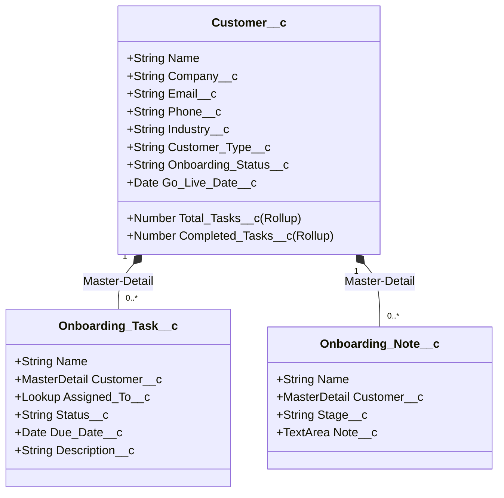

# Architecture Documentation: Customer Onboarding Tool

This document outlines the technical architecture, data model, layering, and design patterns implemented for the Customer Onboarding Tool.

---

## 1. Data Model & Relationships

The tool is built on three custom objects containing specific relationships, rollups, and validation rules to track onboarding stages and tasks:



### Rollup Summary Fields
- **`Customer__c.Total_Tasks__c`**: Counts all related `Onboarding_Task__c` records.
- **`Customer__c.Completed_Tasks__c`**: Counts related `Onboarding_Task__c` records where `Status__c = 'Completed'`.

### Validation Rules
- **`Customer__c.Go_Live_Date_In_Future`**: Ensures that the `Go_Live_Date__c` is in the future relative to the record creation or modification date.
- **`Onboarding_Task__c.Due_Date_Required`**: Requires that the `Due_Date__c` field is not empty before saving.

---

## 2. Multi-Tier Application Layering

The codebase is organized into strict architectural layers to ensure isolation of concerns, maintainability, and clean Apex unit testing:

```
┌────────────────────────────────────────────────────────┐
│               Lightning Web Components                 │
│  (onboardingApp, onboardingDashboard, customerList...) │
└──────────────────────────┬─────────────────────────────┘
                           │ UI Events / Actions
                           ▼
┌────────────────────────────────────────────────────────┐
│               Aura-Enabled Controllers                 │
│      (CustomerController, TaskController...)           │
└──────────────────────────┬─────────────────────────────┘
                           │ Service Delegations
                           ▼
┌────────────────────────────────────────────────────────┐
│                 Apex Service Layer                     │
│        (CustomerService, TaskService...)               │
└──────────────────────────┬─────────────────────────────┘
                           │ Data Access / DML
                           ▼
┌────────────────────────────────────────────────────────┐
│                 Database / Schema                      │
│        (Customer__c, Onboarding_Task__c...)            │
└────────────────────────────────────────────────────────┘
```

### 1. Database & Apex Trigger Layer
- **`OnboardingTrigger`**: Orchestrates field audits and notifications on `Customer__c` changes. Runs before and after DML.
- **`OnboardingTriggerHandler`**: Executed on `after update` of `Customer__c`. Detects changes in the `Onboarding_Status__c` stage field and automatically shoots bulkified, single-invocation emails to the Account Owner notifying them of stage updates.

### 2. Service Layer (Business Logic)
- **`CustomerService`**: Houses logic for Customer CRUD, list/search filters, and status transitions (where it updates status and logs standard `Onboarding_Note__c` audit trails in a unified transaction).
- **`TaskService`**: Manages task creation, completion toggling, and queries for overdue/upcoming tasks.
- **`DashboardService`**: Aggregates metrics (Total Customers, Overdue Tasks, and Ready for Go-Live counts) and stages distribution.

### 3. Controller Layer (Aura-Enabled)
- **`CustomerController` / `TaskController` / `DashboardController`**: Light adapters exposing service methods to LWCs. Handled exceptions are caught here and wrapped in `AuraHandledException` to hide raw database details from UI layers while passing messages.

### 4. REST Resource Layer (API Endpoints)
- **`CustomerRestResource`**: Maps `/onboarding/customers/*` routes.
- **`TaskRestResource`**: Maps `/onboarding/tasks/*` routes.
- Handles parsing path variables, query string parameters, and deserializing payloads. Translates exceptions to correct HTTP status codes:
  - `200`: Success.
  - `201`: Record created.
  - `400`: Validation/JSON errors.
  - `404`: Record not found.

---

## 3. Design Decisions & Security

### FLS & CRUD Security
To pass Salesforce's strict security audits:
1. All static SOQL queries use the `WITH SECURITY_ENFORCED` clause, ensuring the running user has Field-Level Security read access to all requested fields.
2. Dynamic SOQL queries append `WITH SECURITY_ENFORCED` dynamically before `ORDER BY` and `LIMIT` clauses.
3. DML operations utilize `Security.stripInaccessible(AccessType, List)` to check FLS edit/create accessibility and strip any fields that the user does not have access to before executing database writes.

### Exception Design Pattern
- Service layer methods throw standard Apex exceptions (like `IllegalArgumentException` or `QueryException`) rather than `AuraHandledException`.
- This ensures that:
  1. Exception types and exact error messages are preserved during unit test runs (since Salesforce strips message content on `AuraHandledException` inside tests).
  2. REST Resources can catch distinct exceptions (e.g. catch `QueryException` and return 404, catch `IllegalArgumentException` and return 400).
- Controllers catch these exceptions and map them to `AuraHandledException` so they display nicely to the LWC UI.

### Component Communication model (LWC)
- The shell `onboardingApp` handles shared states (`selectedCustomerId`).
- Data flows down via public `@api` properties on child components.
- Actions flow up via custom events:
  - `customerselect`: updates the selected customer ID.
  - `statuschange`: refreshes the list and dashboard.
  - `taskchange`: refreshes the customer details progress percentage and the dashboard.
- This decoupling allows components to remain highly reusable.
